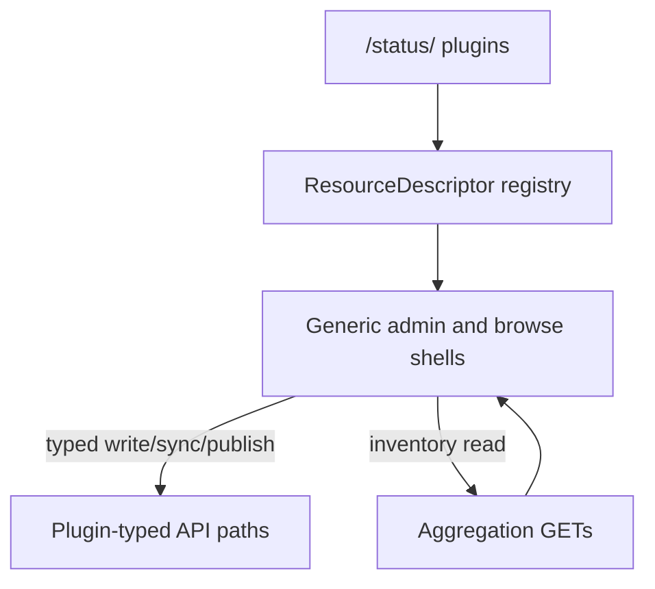

# Architecture

**Core idea:** the UI is **plugin-agnostic**. Screens are organized by pulpcore concepts (Repository, Remote, Distribution, Publication, Content, Task), not by plugin name. The same generic shells render every plugin; plugin-specific behavior comes from **ResourceDescriptors**, not from parallel `/file/…` or `/rpm/…` page trees.

Full ADR: [`plan.md`](../plan.md).

## Why generic shells

- Pulp aggregation APIs (`/repositories/`, …) are mostly **inventory**. Create, sync, publish need **plugin-typed** paths (`/repositories/file/file/`, …).
- A pulpcore-only UI cannot finish content workflows. A per-plugin page tree does not scale to “one UI for all plugins.”
- Descriptors sit in the middle: Master/Detail UX + typed API, without forking the IA per plugin.

## How it works

1. **Discover plugins** at boot via `/status/` → `PluginContext`.
2. **Ship descriptors** in the bundle (v1: `file.*`); activate with `isAvailable(plugins)`.
3. Each **ResourceDescriptor** (`pulp_type`, e.g. `file.file`) declares kind, list/detail/forms, actions (sync/publish/upload/…), and browse fields.
4. **Generic shells** (one repo list/detail, one remote list/detail, …) look up the descriptor from the entity’s `pulp_type` and render/actions accordingly.
5. **Unknown plugins** still show in aggregation lists as **read-only** until a descriptor exists.
6. **Add a plugin later:** new descriptors (+ query hooks) — no new top-level nav, no `pages/<plugin>/` routes. See [CONTRIBUTING.md](../CONTRIBUTING.md).

## Product shape (v1)

- Dual-equal **admin** and **consumer browse**
- Ships platform pages + `file.*` descriptors; more plugins via descriptors only
- Rejected as primary UX: per-plugin route trees, pure OpenAPI auto-forms

## Code map (where the idea lives)

- `client/src/app/descriptors/` — registry + plugin packages
- `client/src/app/pages/resources/` — generic admin shells
- `client/src/app/pages/browse/` — consumer browse shells
- `client/src/app/pages/platform/` — login, tasks, access (pulpcore)
- `client/src/app/context/` — Auth, Plugin, Notifications

## Related

- [CONTRIBUTING.md](../CONTRIBUTING.md) — add a descriptor
- [README.md](../README.md) — run / env
- [A11Y_PERF.md](A11Y_PERF.md) — deferred a11y/perf
- [plan.md](../plan.md) — full ADR
