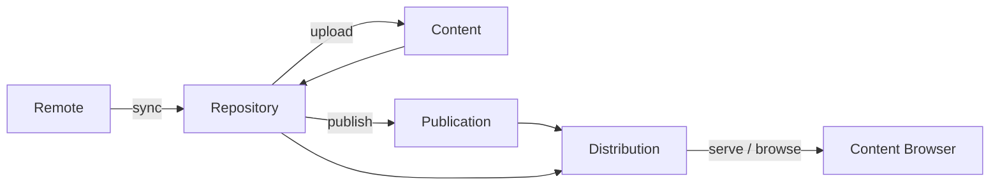
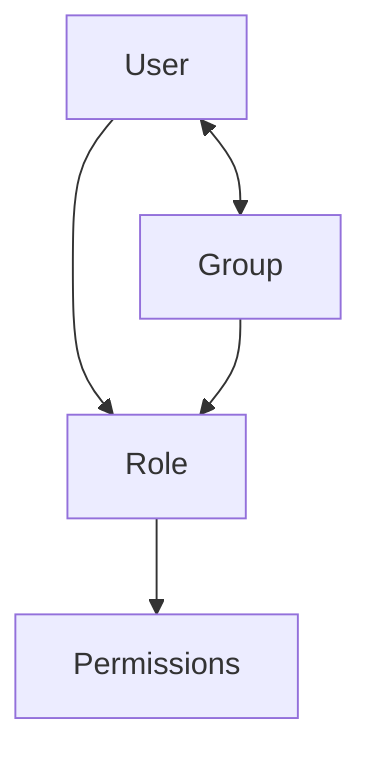

# UI entities and relationships

This document describes the **domain concepts** exposed in Pulp UI — what each screen is for and how entities connect. It is for contributors and operators of this UI, not a React component API reference.

For how generic shells and descriptors work, see [ARCHITECTURE.md](ARCHITECTURE.md).

## Where things live in the nav

| Nav group          | Entities                                                    |
| ------------------ | ----------------------------------------------------------- |
| Main               | Dashboard, Tasks                                            |
| Content Management | Repositories, Remotes, Distributions, Publications, Content |
| Browse             | Content Browser                                             |
| Administration     | Users, Groups, Roles, Signing Services                      |

Admin routes use the authenticated console shell. The Content Browser is a **separate consumer surface** (own layout/nav) under `/browse`.

---

## Content lifecycle

How content typically moves through the UI:

Async work (sync, publish, upload, many deletes) usually creates a **Task** that you can follow under Tasks.

---

## Content management entities

These screens are **concept-based** (not per-plugin route trees). Aggregation lists can show many `pulp_type`s; **create / edit / sync / publish / upload** require a registered [ResourceDescriptor](ARCHITECTURE.md). In v1, writable descriptors ship only for **`file.file`**.

### Repository

- **Routes:** `/repositories`, `/repositories/$repoId`
- **Purpose:** Versioned container for content. Sync from a Remote, accept uploads, and publish snapshots.
- **Relates to:** Optional linked **Remote**; produces **Publications**; can be pointed at by **Distributions**; holds **Content** across versions.
- **Detail tabs:** Details, Versions, Distributions, Content.

### Remote

- **Routes:** `/remotes`, `/remotes/$remoteId`
- **Purpose:** Upstream source configuration (URL, download policy, TLS, timeouts) used when a repository syncs.
- **Relates to:** Consumed by **Repository** sync; not browsable by consumers on its own.

### Publication

- **Routes:** `/publications`, `/publications/$pubId`
- **Purpose:** Immutable snapshot of a repository version produced by publish.
- **Relates to:** Created from a **Repository** (and version); often attached to a **Distribution** for serving.

### Distribution

- **Routes:** `/distributions`, `/distributions/$distId`
- **Purpose:** Serves content at a base path / URL by binding a repository and/or publication (and optional content guard).
- **Relates to:** Points at **Repository** and/or **Publication**; entry point for the **Content Browser**.

### Content

- **Admin routes:** `/content`, `/content/$contentId`
- **Purpose:** Individual content units (in v1, files with relative path and checksums). Admin inventory plus upload into a repository.
- **Relates to:** Lives in **Repository** versions; exposed to consumers through a **Distribution**.

### Content Browser

- **Routes:** `/browse`, `/browse/$distributionId`, `/browse/$distributionId/$contentId`
- **Purpose:** Consumer-oriented listing and download of units for a distribution (separate shell from the admin console).
- **Relates to:** Starts from a **Distribution**, then resolves content via the distribution’s repository latest version or publication repository version.
- **Note:** Browsing is supported for described file distributions; unsupported types stay read-only / non-browsable in the UI.

---

## Platform entities

These are pulpcore-oriented screens (no content descriptors).

### Dashboard

- **Route:** `/`
- **Purpose:** At-a-glance status from `/status/`: installed plugins/versions, online workers, storage.
- **Relates to:** Plugin discovery drives which descriptors become available for content actions.

### Task

- **Routes:** `/tasks`, `/tasks/$taskId`
- **Purpose:** Track asynchronous jobs (state, timestamps, progress, errors, related resources). Cancel when the task is still running/waiting.
- **Relates to:** Created by sync, publish, upload, and many other mutating operations across content entities.

---

## Access control (RBAC)

### User

- **Routes:** `/admin/users`, `/admin/users/$userId`
- **Purpose:** Login accounts (username, email, active/staff, membership).
- **Relates to:** May belong to **Groups**; holds assigned **Roles**.

### Group

- **Routes:** `/admin/groups`, `/admin/groups/$groupId`
- **Purpose:** Named collections of users that share role assignments.
- **Relates to:** Contains **Users**; assigned **Roles**.

### Role

- **Routes:** `/admin/roles`, `/admin/roles/$roleId`
- **Purpose:** Named permission sets (often plugin-generated, e.g. `file.filerepository_viewer`). Locked roles are not editable in the UI.
- **Relates to:** Granted to **Users** and **Groups**; list includes a Plugin column derived from the role name prefix.

### Signing Service

- **Route:** `/admin/signing-services` (list only)
- **Purpose:** Read-only inventory of signing services (name, public key fingerprint, script).
- **Relates to:** Platform inventory in v1 — **no create/edit in this UI**; provision outside the console (API/CLI).

---

## How entities relate (summary)

| From                     | To              | Relationship                 |
| ------------------------ | --------------- | ---------------------------- |
| Remote                   | Repository      | Sync source                  |
| Repository               | Content         | Holds units / accepts upload |
| Repository               | Publication     | Publish creates a snapshot   |
| Repository / Publication | Distribution    | Serving bind                 |
| Distribution             | Content Browser | Consumer access              |
| Mutations                | Task            | Async progress               |
| User / Group             | Role            | RBAC grants                  |

---

## v1 caveats (this repo)

1. **Descriptor-driven writes for `file.file` only** — other plugins may appear in aggregation lists but stay **read-only** until a descriptor exists.
2. **Unknown `pulp_type` → read-only** — lists show a Read-only affordance; create/sync/publish/upload stay gated.
3. **Browse is a dual surface** — `/browse` uses its own layout; not the same nav chrome as the admin console.
4. **Signing services are list-only** — no invent write path in the UI.
5. **Domains UI is out of scope** — no Domain pages; API calls may still be domain-scoped via configuration (`PULP_DOMAIN`).
6. **Concept-based IA** — add plugins with new descriptors and query hooks, not new top-level nav trees per plugin.

---

## Related docs

- [ARCHITECTURE.md](ARCHITECTURE.md) — generic shells and ResourceDescriptors
- [CONTRIBUTING.md](../CONTRIBUTING.md) — adding a descriptor
- [README.md](../README.md) — run / environment
- [plan.md](../plan.md) — product ADR
