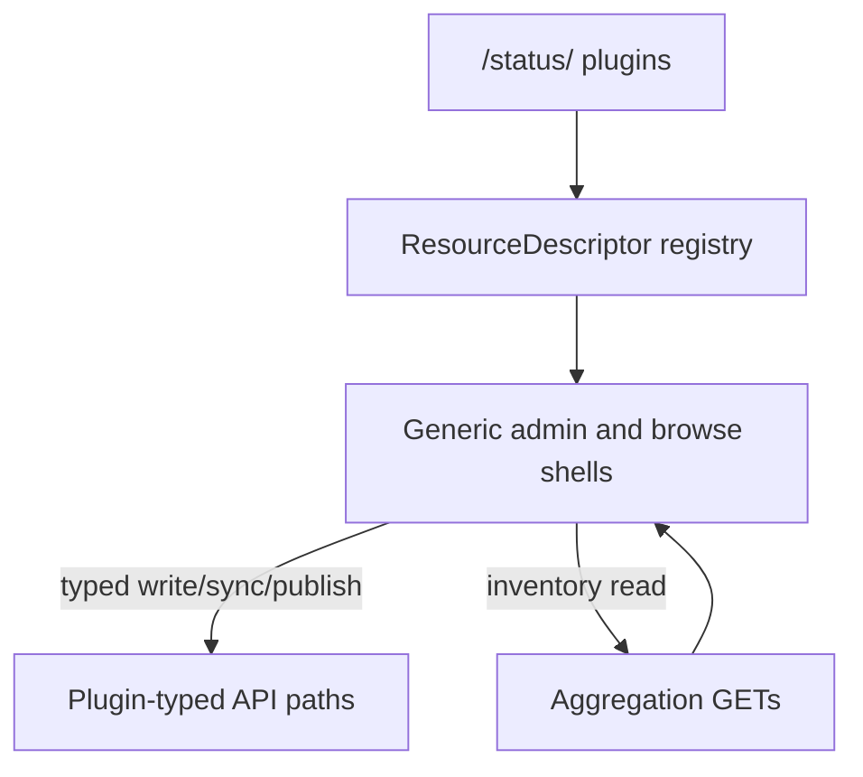
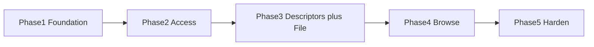

# ADR: pulp-ui-2 Application Architecture

## Status

Proposed — 2026-08-01

## Context

Pulp is a content management platform with a plugin architecture. **pulpcore** provides the platform: REST API (Django/DRF), tasking system, content serving app, and base models (Repository, Remote, Distribution, Publication, Content, Task, Domain, User, Group, Role). **Plugins** extend pulpcore for specific content types; `pulp_file` is bundled with pulpcore as the reference plugin.

Docs and the OpenAPI agree: pulpcore alone cannot complete content workflows. Aggregation endpoints (`/repositories/`, `/remotes/`, `/distributions/`, …) are primarily read-only inventories. Create/sync/publish require plugin-typed paths (e.g. `/repositories/file/file/`).

The existing `pulp-ui-2` repository has a working monorepo skeleton (`common`, `client`, `server`) with React 19, PatternFly 6, Vite, TanStack Query, and an auto-generated OpenAPI client. It currently only contains Python package browsing pages inherited from ui-packages.redhat.com. **All existing pages will be redesigned from scratch.**

### Product decisions (locked)

- **Identity:** Dual-equal — admin console and consumer browse are both first-class.
- **v1 content scope:** pulpcore platform + `pulp_file` only.
- **Extensibility:** Data-driven UI so the _same_ shells render all plugins; v1 proves the model with `file.*`.
- **Architecture choice:** **Approach C — Hybrid Master/Detail + ResourceDescriptor registry** (not per-plugin page trees, not pure OpenAPI auto-UI).

### Reference codebases informing this design

| Codebase                   | What we take from it                                                                                                                                                                                                               |
| -------------------------- | ---------------------------------------------------------------------------------------------------------------------------------------------------------------------------------------------------------------------------------- |
| **trustify-ui**            | Tech stack, monorepo structure, CI/CD patterns, component architecture (lazy routes, query hooks pattern, layout system). Inline any external reusable workflows — do not depend on `guacsec/trustify-release-tools` by reference. |
| **pulp-ui** (legacy)       | Domain knowledge — page concepts, plugin-aware nav idea, action system (create/edit/delete/sync as composable actions + modals), ListPage/PageWithTabs patterns. **Not** per-plugin IA or plaintext credential storage.            |
| **ui-packages.redhat.com** | Browse hierarchy, card/list UX, lazy-loaded metadata, label-enriched distributions, detail tabs. **Not** RH marketing/RHAI taxonomy.                                                                                               |
| **pulp docs + OpenAPI**    | Master/Detail model, aggregation vs typed CRUD, task 202s, `pulp_href` identity.                                                                                                                                                   |

---

## Decision 1: Plugin-generic, descriptor-driven UI

### Decision

Organize the UI by pulpcore concepts (Repository, Remote, Distribution, Publication, Content, Task), not by plugin name. Use a **ResourceDescriptor registry** with static compilation and dynamic activation:

1. **Plugin discovery at boot:** Query `/pulp/api/v3/status/` on init for installed plugins as `{ component, version }[]`. Store in `PluginContext` (fetched once, cached).
2. **Static descriptors, dynamic activation:** Supported descriptor modules (starting with `file.*`) ship in the bundle; activation depends on status. Unused paths can tree-shake where practical.
3. **ResourceDescriptor (per `pulp_type`, e.g. `file.file`):** Declarative package defining:
   - master kind (repository / remote / distribution / publication / content)
   - list columns, filters, default sort
   - create/edit form fields
   - detail tabs and field groups
   - actions (sync, publish, upload, delete, …) and whether each returns a Task
   - browse presentation (card fields, detail sections, download)
   - `isAvailable(plugins)` from status
4. **Generic shells consume the registry:** One Repository list/detail, one Remote list/detail, etc. Shells resolve the descriptor from the row/entity `pulp_type`.
5. **Adding a plugin later:** Add descriptors (+ optional browse adapter). No new top-level nav section and no `pages/<plugin>/` route tree.



### v1 and unknown plugins

- **v1 ships:** platform pages + descriptors for `file.*` only.
- **Unknown installed plugins:** visible in aggregation lists (name, `pulp_type`, href) as **read-only**; create/actions disabled until a descriptor exists.

### Rationale

Pure pulpcore-only UI cannot create/sync/publish. Per-plugin page trees (legacy pulp-ui / earlier draft `/file/...`) fight “one UI for all plugins.” Fully OpenAPI-generated forms are too blunt for Pulp workflows (tasks, sync, browse). Descriptors match Master/Detail while keeping one IA.

### Rejected

- pulp-ui-style `/file/...`, `/rpm/...` page trees as the primary IA
- Pure OpenAPI auto-UI as the primary UX
- Storing plaintext Basic credentials in session/localStorage

---

## Decision 2: Application structure

### Decision

Retain the existing monorepo and extend it with an `e2e/` workspace:

```
pulp-ui-2/
  common/               # Shared types, env config, branding (exists)
  client/               # React SPA (exists, to be restructured)
    config/              # openapi-ts config (exists)
    openapi/             # OpenAPI spec (exists, pulp.json)
    src/app/
      api/               # Domain models, REST helpers
      axios-config/      # Axios interceptors, auth/CSRF (exists)
      client/            # AUTO-GENERATED OpenAPI client (exists)
      components/        # Shared UI: filters, confirm dialogs, task toasts, etc.
      context/           # Auth, Plugin/status, Notifications (new)
      descriptors/       # ResourceDescriptor registry + file.* packages (new)
      hooks/             # Selection, URL params, shared hooks
      layout/            # Header, sidebar, default-layout (exists)
      pages/
        platform/        # Login, Dashboard, Tasks, Users, Groups, Roles, Signing
        resources/       # Generic repository/remote/distribution/publication/content shells
        browse/          # Consumer-facing content browser
      queries/           # TanStack Query hooks per domain (exists / expand)
      routes/            # TanStack Router route tree composition (new)
      utils/             # Helpers (exists)
  server/               # Express proxy server (exists)
  e2e/                  # Playwright E2E tests (new)
```

**Note:** Earlier draft used `pages/core/` + `pages/file/`. That is superseded: platform vs generic resource shells vs browse; plugin specifics live under `descriptors/`, not parallel page trees.

---

## Decision 3: Tech stack

### What stays (already in place)

| Tool                   | Current Version | Notes                                                             |
| ---------------------- | --------------- | ----------------------------------------------------------------- |
| React                  | ^19.1.1         |                                                                   |
| TypeScript             | ^5.9.3          |                                                                   |
| Vite                   | ^7.1.2          | Build + dev server                                                |
| PatternFly             | ^6.4.0          | react-core, react-tokens (keep for UI; NOT as table state engine) |
| TanStack Query         | ^5.90.11        | Data fetching + cache                                             |
| Axios                  | ^1.7.2          | HTTP client                                                       |
| @hey-api/openapi-ts    | ^0.92.3         | API client generation                                             |
| Vitest                 | ^4.0.0          | Unit tests                                                        |
| @testing-library/react | ^16.0.0         | Component testing                                                 |
| dayjs                  | ^1.11.18        | Date formatting                                                   |
| react-error-boundary   | ^6.0.0          | Error boundaries                                                  |

### What to replace

| Remove                                 | Replace with                                | Rationale                                                                                                                   |
| -------------------------------------- | ------------------------------------------- | --------------------------------------------------------------------------------------------------------------------------- |
| Biome                                  | **ESLint ^10 + Prettier ^3**                | Match trustify-ui. Flat config with typescript-eslint, @eslint-react, @tanstack/eslint-plugin-query, eslint-plugin-prettier |
| react-router-dom                       | **@tanstack/react-router**                  | Type-safe routing, search-param validation, loaders                                                                         |
| @patternfly/react-table as state layer | **@tanstack/react-table** + PF table markup | Headless table state; PatternFly visuals                                                                                    |

### What to add

| Tool                             | Purpose                        | Source              |
| -------------------------------- | ------------------------------ | ------------------- |
| @tanstack/react-router           | Type-safe routing              | User requirement    |
| @tanstack/react-table            | Headless table state           | User requirement    |
| @tanstack/eslint-plugin-router   | Lint rules for router          | Complements router  |
| Playwright                       | E2E tests                      | trustify-ui pattern |
| ESLint ^10                       | Linting (flat config)          | trustify-ui pattern |
| Prettier ^3                      | Formatting                     | trustify-ui pattern |
| react-hook-form + yup            | Forms + validation             | trustify-ui pattern |
| @vitest/coverage-v8              | Coverage                       | trustify-ui pattern |
| commitlint + husky + lint-staged | Commit conventions + git hooks | trustify-ui pattern |

### ESLint configuration (from trustify-ui)

Flat config (`eslint.config.mjs`) extending: eslint recommended, typescript-eslint recommended, @eslint-react recommended-typescript, @tanstack/query recommended-strict, @tanstack/router recommended, react-refresh vite, prettier recommended. Ignore generated code (`client/src/app/client/**`).

### Notable divergences from trustify-ui

- **TanStack Router** instead of react-router-dom.
- **TanStack Table** instead of custom `table-controls` as the primary table engine (still render PF markup).
- **No @tsd-ui/core** required; existing theme setup is sufficient.
- **No OIDC** (oidc-client-ts / react-oidc-context). Basic + session auth instead.
- **ResourceDescriptors** instead of trustify’s feature-folder-only model for plugin variance.

---

## Decision 4: Surfaces, navigation, and page inventory

### Navigation (concept-based, not plugin-named)

```
[Main]
  Dashboard
  Tasks

[Content management]     # generic shells; pulp_type filter/badge
  Repositories
  Remotes
  Distributions
  Publications
  Content

[Browse]                 # dual-equal consumer half
  Content browser

[Administration]
  Users
  Groups
  Roles
  Signing services
```

Future plugins do **not** add top-level nav sections unless they introduce a truly new concept. Descriptor availability may hide create actions, not entire concept sections.

**v1 non-goals:** Domains UI, full multi-plugin descriptors, Galaxy/AH/container surfaces, OIDC, OpenAPI auto-forms as primary UX.

### Page inventory and expectations

Routes use TanStack Router `$param` style. Resource pages are **generic shells**; v1 interactive behavior comes from `file.*` descriptors. Unknown `pulp_type`s remain visible and read-only.

#### Shell and auth

| Page      | Route    | Phase | Type  | Key data / actions                   | Expectations                                                                       |
| --------- | -------- | ----- | ----- | ------------------------------------ | ---------------------------------------------------------------------------------- |
| Login     | `/login` | 1     | Form  | Username/password; session establish | PatternFly login; redirect to `?redirect=` or Dashboard; no credential persistence |
| App shell | (layout) | 1     | Shell | Header, sidebar, user menu, toasts   | Concept-based nav; logout; task notifications                                      |
| Not found | `*`      | 1     | Empty | —                                    | Friendly 404 with link to Dashboard or Browse                                      |

#### Platform (admin)

| Page        | Route            | Phase | Type      | Key data / actions                                                                    | Expectations                                                                                                           |
| ----------- | ---------------- | ----- | --------- | ------------------------------------------------------------------------------------- | ---------------------------------------------------------------------------------------------------------------------- |
| Dashboard   | `/`              | 1     | Dashboard | Plugins/versions, workers, storage                                                    | Status landing; links into Tasks and Content management; handle status failure                                         |
| Task list   | `/tasks`         | 1     | List      | Name, state, started/finished, progress; filters: state, name; actions: cancel, purge | Paginated table; row → detail; maintenance actions (e.g. orphan cleanup) may hang off this page later, not separate IA |
| Task detail | `/tasks/$taskId` | 1     | Detail    | Progress reports, error/traceback, created resources, child tasks                     | Poll/refetch while running; link related hrefs                                                                         |

#### Access management (admin)

| Page               | Route                     | Phase | Type        | Key data / actions                                         | Expectations                               |
| ------------------ | ------------------------- | ----- | ----------- | ---------------------------------------------------------- | ------------------------------------------ |
| User list          | `/admin/users`            | 2     | List        | Username, email, groups; create/edit/delete                | Standard list + unauthorized state         |
| User detail        | `/admin/users/$userId`    | 2     | Detail+Tabs | Details; roles (and groups as API allows)                  | Editable profile; clear role assignment UX |
| Group list         | `/admin/groups`           | 2     | List        | Name, users count; create/edit/delete                      | Navigate to detail                         |
| Group detail       | `/admin/groups/$groupId`  | 2     | Detail+Tabs | Details; users membership; roles                           | Add/remove users; manage roles             |
| Role list          | `/admin/roles`            | 2     | List        | Name, description, permissions summary; create/edit/delete | Reviewable permission summary              |
| Role detail / edit | `/admin/roles/$roleId`    | 2     | Detail/Form | Permission set                                             | Not a raw JSON editor                      |
| Signing services   | `/admin/signing-services` | 2     | List        | Read-only listing                                          | No invented write flows                    |

#### Content management (generic shells + descriptors)

| Page                   | Route                    | Phase | Type        | Key data / actions                                                                             | Expectations                                                  |
| ---------------------- | ------------------------ | ----- | ----------- | ---------------------------------------------------------------------------------------------- | ------------------------------------------------------------- |
| Repository list        | `/repositories`          | 3     | List        | Name, description, `pulp_type`, remote/last-sync hints; create/sync/edit/delete when described | Aggregation read; `pulp_type` filter; unknown types read-only |
| Repository detail      | `/repositories/$repoId`  | 3     | Detail+Tabs | Tabs: Details, Versions, Distributions, Content; actions: sync, edit, delete                   | Sync → Task; type badge; descriptor-driven fields/actions     |
| Remote list            | `/remotes`               | 3     | List        | Name, URL, policy, `pulp_type`; create/edit/delete when described                              | Cross-plugin inventory                                        |
| Remote detail          | `/remotes/$remoteId`     | 3     | Detail      | URL, policy, TLS/cert fields as applicable                                                     | Edit/delete when described; no fake fields                    |
| Distribution list      | `/distributions`         | 3     | List        | Name, base_path, `pulp_type`, repository/publication; create/edit/delete when described        | Link toward browse where useful                               |
| Distribution detail    | `/distributions/$distId` | 3     | Detail      | Config, content guard summary                                                                  | Deep-link friendly for browse                                 |
| Publication list       | `/publications`          | 3     | List        | Repository version, created time, type; create/delete when described                           | Create often → Task                                           |
| Publication detail     | `/publications/$pubId`   | 3     | Detail      | Metadata; links to version/distributions                                                       | Read-focused                                                  |
| Content list           | `/content`               | 3     | List        | Path/name, digest, size, `pulp_type`; upload (file)                                            | Cross-plugin inventory + file upload                          |
| Content detail (admin) | `/content/$contentId`    | 3     | Detail      | Identity, artifacts/checksums, repo hints                                                      | Admin view; download when available                           |

Shared expectations for content-management pages:

- TanStack Table + URL search params for filters/pagination/sort.
- 202 mutations → toast + link to Task detail.
- 401 → login; 403 → unauthorized empty state.
- Missing descriptor ⇒ read-only with explanation.

#### Browse (consumer, dual-equal)

| Page                    | Route                                | Phase | Type          | Key data / actions                                                   | Expectations                        |
| ----------------------- | ------------------------------------ | ----- | ------------- | -------------------------------------------------------------------- | ----------------------------------- |
| Distribution browser    | `/browse`                            | 4     | Card/List     | Distributions; search/filters; name, description/`pulp_labels`, type | Consumer-first; not admin workflows |
| Content browser         | `/browse/$distributionId`            | 4     | Card/List     | Units in distribution; v1 file: path, size, digest                   | Breadcrumb to `/browse`             |
| Content detail (browse) | `/browse/$distributionId/$contentId` | 4     | Detail(+Tabs) | Metadata, checksums, download                                        | No admin actions (sync/delete/RBAC) |

Browse shared expectations: first-class IA; auth only per Pulp policy; presentation from descriptor browse fields (v1: file).

#### Explicitly not v1 pages

- Per-plugin trees (`/file/...`, `/rpm/...`, …)
- Domains admin, Galaxy collections/namespaces, container Hub, Hub multi-search, OIDC UI
- Python package browse as primary product (legacy pages replaced by generic browse + future python descriptor)

---

## Decision 5: API integration strategy

1. **Full schema generation, selective use:** Keep generating the full OpenAPI client from `pulp.json`. Tree-shaking unused endpoints; filtering the schema adds build complexity for little benefit.
2. **Query hooks pattern** (per domain file in `queries/`):
   - `use<Entity>ListQuery(params)` — paginated list with filters
   - `use<Entity>DetailsQuery(href)` — single entity by `pulp_href`
   - `use<Entity>CreateMutation()` / `UpdateMutation()` / `DeleteMutation()` — + cache invalidation
   - Domain-specific actions: e.g. repository sync, publish, content upload (wired through descriptors)
3. **Query key management:** Centralized `queryKeys`. Pattern: `[domain, 'list', params]` or `[domain, 'detail', href]`.
4. **Pulp-specific API considerations:**
   - Objects identified by URL (`pulp_href`), not numeric PK
   - Long-running ops return HTTP 202 + task reference — UI must surface task progress
   - Cursor-based pagination by default
   - Hyperlinked relationships
5. **Aggregation vs typed paths:** Shells **read** via aggregation GETs; **write/act** via typed plugin paths resolved by the active descriptor.
6. **Tables:** `@tanstack/react-table` for column defs, sorting, filtering, pagination, selection; render with PatternFly `<Table>`, `<Thead>`, `<Tbody>`, `<Tr>`, `<Th>`, `<Td>`.
7. **Routing:** `@tanstack/react-router` route trees for platform / resources / browse, composed at root. Search params hold filters/pagination/sort. Loaders may `ensureQueryData` via TanStack Query.
8. **Descriptors are not a second HTTP stack:** They select which generated client operations and invalidations the shells use.

---

## Decision 6: Authentication strategy

### Decision

Use pulpcore native auth: **HTTP Basic for login establishment, Session/Cookie for subsequent requests.**

1. **Login flow:** PatternFly `LoginPage` → validate (e.g. authenticated status call) → `POST /pulp/api/v3/login/` to establish session cookie → redirect to requested page.
2. **Session-first:** After login, requests use the cookie (`withCredentials: true`), not stored passwords.
3. **No credential storage:** Only `{ isAuthenticated, username }` in React state. Browser session cookie provides persistence. Redirect to login on 401.
4. **CSRF:** For state-changing requests, read `csrftoken` cookie → `X-CSRFToken` header (Django session auth).
5. **AuthContext:** `{ user, isAuthenticated, login(), logout() }`. Protect admin routes with TanStack Router `beforeLoad` → `/login?redirect=<path>`.
6. **Browse auth posture:** Public or lightly gated subject to Pulp access policies; do not force the full admin shell.

### Rationale

Improves on pulp-ui’s plaintext Basic credentials in sessionStorage. Session auth matches Django’s design; no external IdP required for v1.

---

## Decision 7: CI/CD pipeline

### Self-contained workflows (no external reusable workflow references)

| Workflow                           | Trigger           | What it does                                                                                                            |
| ---------------------------------- | ----------------- | ----------------------------------------------------------------------------------------------------------------------- |
| **ci.yaml** (extend existing)      | push to main, PRs | Checkout, Node 22, `npm ci`, generate if needed, build, lint, format, test with coverage, upload coverage artifact      |
| **ci-e2e.yaml** (new)              | push to main, PRs | Start Pulp via docker-compose (`pulp/pulp` or equivalent), build UI, serve, run Playwright, upload artifacts on failure |
| **CodeQL** (keep in ci or sibling) | push to main, PRs | JS CodeQL security analysis                                                                                             |
| **image-build.yaml** (new)         | tags, releases    | Build container image, push to registry — **inline** any steps currently living in external release-tools workflows     |
| **deploy.yaml** (exists)           | push to main      | Deploy mock-data demo to GitHub Pages                                                                                   |

External **actions** limited to standard ones where possible (`actions/checkout`, `actions/setup-node`, `github/codeql-action`). Do not `uses:` org-private reusable workflows.

---

## Decision 8: Testing strategy

| Layer     | Tool                                       | Scope                                     | Location                           |
| --------- | ------------------------------------------ | ----------------------------------------- | ---------------------------------- |
| Unit      | Vitest + Testing Library                   | Components, hooks, descriptors, utilities | `*.test.tsx` colocated with source |
| E2E       | Playwright                                 | Login, tasks, file admin loop, browse     | `e2e/tests/`                       |
| Mock data | Existing `mockQueryFn` / `MOCK=on` pattern | Dev, GH Pages demo, unit tests            | `queries/mocks/`                   |

---

## Decision 9: Phased implementation roadmap

Phases are sequential; each ends with an **exit criterion**. Detailed coding plans come after this ADR is accepted.



### Phase 0 — ADR freeze

- This document (`plan.md`) is the frozen ADR for pulp-ui-2.
- **Exit:** ADR accepted; implementation planning may start.

### Phase 1 — Foundation (tooling, shell, auth, status, tasks)

**Goal:** Runnable app on the locked stack; login, Dashboard, Tasks.

1. Tooling: ESLint + Prettier; TanStack Router; TanStack Table; react-hook-form + yup; husky/lint-staged/commitlint; update OpenAPI generate post-process off Biome.
2. Layout: `e2e/` placeholder; `context/`, `descriptors/`, `routes/`; page areas `platform|resources|browse`.
3. Auth: login, session, CSRF, AuthContext, `beforeLoad` guards.
4. PluginContext from `/status/`.
5. Layout + concept-based nav skeleton.
6. Dashboard + Task list/detail (cancel/purge); task toast pattern.
7. CI baseline: build, lint, format, unit tests + coverage.
8. Keep mock infrastructure working for demos.

**Exit:** Authenticated Dashboard + Tasks against live Pulp; unit CI green; stack matches Decision 3.

### Phase 2 — Access management

**Goal:** RBAC admin complete.

1. Users list/detail/create/edit/delete.
2. Groups list/detail + membership.
3. Roles list/detail/create/edit permissions.
4. Signing services list.
5. 403 unauthorized states.

**Exit:** Admin can manage users/groups/roles; signing services visible.

### Phase 3 — Descriptor platform + file admin loop

**Goal:** Prove Approach C; complete file lifecycle in admin.

1. ResourceDescriptor contract + registry + read-only fallback.
2. Generic list/detail shells + create/edit/delete patterns.
3. Domain query hooks (aggregation reads + typed mutations + 202→task).
4. `file.*` descriptors (repository, remote, distribution, publication, content) with sync/publish/upload.
5. Wire `/repositories`, `/remotes`, `/distributions`, `/publications`, `/content` (+ details).
6. Repository detail tabs: details, versions, distributions, content.

**Exit:** File create → sync/upload → publish → distribute via generic shells; unknown plugin types read-only without errors.

### Phase 4 — Browse (dual-equal)

**Goal:** Consumer file browse as a first-class product surface.

1. `/browse` distribution browser (search/filter, labels).
2. Content browser for a distribution.
3. Content detail (metadata, checksums, download).
4. Auth only as Pulp policy requires.
5. Retire legacy Python browse as primary UX.

**Exit:** Consumer can discover a file distribution and view/download content without admin resource pages.

### Phase 5 — Harden

**Goal:** Production confidence.

1. Playwright `e2e/` + self-contained `ci-e2e` (Pulp container; no external workflow refs).
2. Image build workflow (inlined).
3. Error/empty states, a11y, performance (code splitting, prefetch).
4. Contributor docs: add a descriptor; run unit/e2e.

**Exit:** E2E CI green on main paths; image buildable; major a11y/perf issues fixed or tracked.

### Cross-phase rules

- No per-plugin top-level nav (`/file`, `/rpm`, …).
- No plaintext Basic credentials in storage.
- Prefer extending descriptors over forking page trees.
- Defer domains, OIDC, non-file descriptors until after Phase 5 unless product-critical.
- Phases 3 and 4 are both product-critical; order is dependency-driven.

### Post-v1 (out of scope now)

- Additional descriptors (`python.*`, `rpm.*`, …)
- Object-level access tabs
- Domains-aware routing/API client
- Optional schema-assisted form fields inside descriptors

---

## Verification

Validate this ADR against a running Pulp before / during early implementation:

1. **API availability:** `curl -u admin:password http://localhost:24817/pulp/api/v3/status/`
2. **Plugin detection:** `versions` includes `{ component: "file", version: "..." }` (name field may vary; match status schema).
3. **Auth flow:** `curl -c cookies.txt -u admin:password -X POST http://localhost:24817/pulp/api/v3/login/`
4. **OpenAPI:** `client/openapi/pulp.json` exists; `npm run generate` produces typed client.
5. **Build:** `npm run build` succeeds on current monorepo.
6. **Dev server:** `npm run start:dev` serves at `http://localhost:3000`.

---

## Success criteria

1. One UI renders multiple `pulp_type`s through descriptors.
2. v1 completes file loop: create → sync/upload → publish → distribute → browse.
3. Unknown plugins show read-only without breaking the app.
4. Locked toolchain and self-contained CI are in place.
5. Phase 1–5 exit criteria are met in order.
